# Elucidating the properties of At4g38090 from *A. thaliana*

## Introduction 

In recent years, there has been a proliferation of bioinformatic
databases, algorithms, and other tools that allow genomic studies to be
carried out more quickly and cheaply than in previous decades. For this
report, several of these resources were used to characterize the
Arabidopsis thaliana gene At4g38090, which encodes for a ribosomal
protein/S5 domain protein. This required collecting annotations
regarding initial impressions, expression analysis, co-expression
analysis, promoter analysis, and network analysis. Protein functionality
was deduced using the concept of 'guilt-by-association', where highly
co-expressed genes that have previously been characterized are assumed
to play a similar role as the target gene in biological processes.
Additionally, analysis of protein-protein interaction networks makes it
possible to further hypothesize what types of biological processes this
gene may be involved in. As will be detailed below, this gene's protein
product appears to be involved in redox reactions, nucleic acid
synthesis, and the catabolism of olefins and amines.

## Results and Discussion

The gene At4g38090 is found on the reverse strand of Chromosome 4
(positions 17,883,679–17,884,821) and is 857 base pairs
long1–3. This gene encodes for a ribosomal protein/S5 domain
protein, goes by the synonyms F20D10.210 or F20D10_210, is associated
with 3 transcripts, and contains 2 exons4. This gene is a
member of the homologous gene family HOM05D006387, which contains 125
genes from 92 species. Additionally, it belongs to the orthologous gene
family ORTHO05D008533, which contains 118 genes from 92 species,
including a single in-paralogue. From the phylogenic tree that was
generated by the PLAZA database (**Figure 1**), there are two visible
duplication events among orthologues, but none were ancestral to the
target gene5. Phylogenic analysis from the Ensembl Plants
database (**Figure 2**) revealed 76 one-to-one orthologues, 4
one-to-many orthologues, and zero many-to-many orthologues3.
The closest relative was determined to be Vitvi07g02582 (most recent
speciation event), an orthologous gene from *Vitis vinifera* (grape).

<figure>
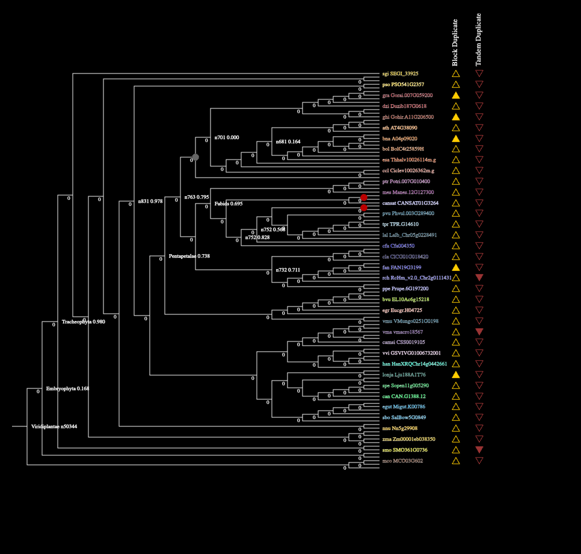
<figcaption>
<strong>Figure 1:</strong> Phylogenic tree as generated
by PLAZA.
</figcaption>
</figure>

<figure>
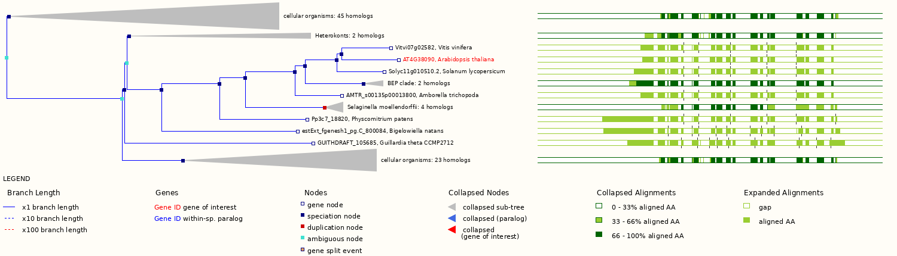
<figcaption>
<strong>Figure 2:</strong> Phylogenic tree as generated
by Ensembl Plants.
</figcaption>
</figure>

The protein product (UniProt: B9DG41) itself is 234 amino acids long,
has a molecular weight of 25212.12 g/mol, and has an isoelectric point
of 8.586. It is classified as a member of the Impact-related
protein family (InterPro: IPR023582; Panther: PTHR16301)7–9.
The InterPro database also identified 3 domains (**Figure 3**), starting
with a Ribosomal protein uS5 domain 2 (IPR020568) and the Impact
N-terminal (IPR001498)8. Additionally, there is a YigZ-like
domain (IPR015796), a C-terminal domain originally observed in
*Escherichia coli* that is believed to be involved in nucleic acid
binding10. This domain is shown in dark blue in **Figure
3**11. Since this is believed to be a ribosomal protein,
binding to DNA and/or RNA is expected to be one of its functions, so
having a domain with this functionality makes sense.

<figure>
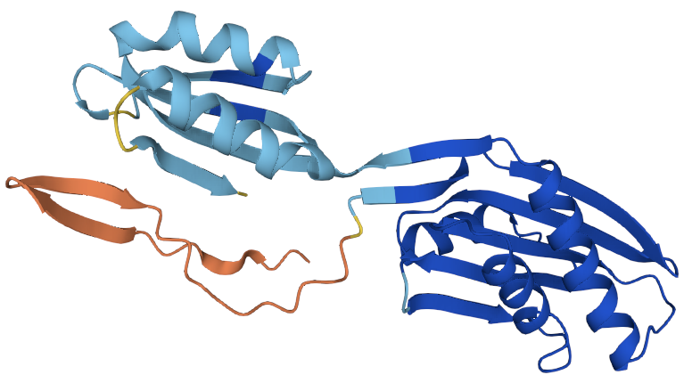
<figcaption>
<strong>Figure 3:</strong> Structure of the protein
product according to AlphaFold.
</figcaption>
</figure>

The SUBA5 database was consulted for studies and predictions of cellular
localization of At4g3809012,13. This tool identified the
mitochondrion as the most likely subcellular localization (**Figure
4**), based primarily on a study that directly observed this
localization using tandem mass spectrometry (MS/MS)14. The
plastid was also indicated as a possible localization site; however, it
was much less favored. Interestingly, none of the available algorithms
on SUBA5 suggested ribosomal localization, although the iPSORT algorithm
predicted endoplasmic reticulum localization15. The BAR Cell
eFP Browser was much less helpful, with most organelles highlighted as
possible localization sites16.

<figure>
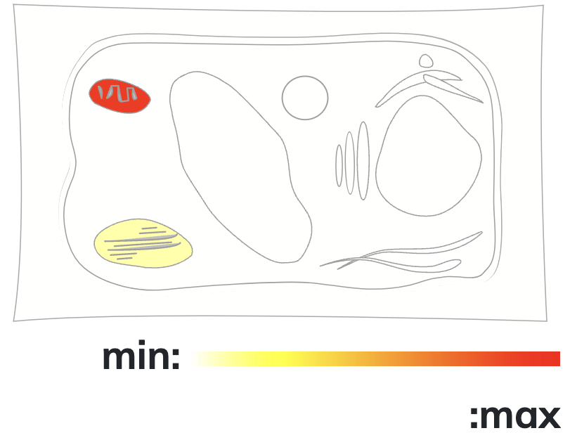
<figcaption>
<strong>Figure 4:</strong> Subcellular localization
according to SUBA5.
</figcaption>
</figure>

Both the BAR Arabidopsis eFP Browser and the Transcriptome Variation
Analysis (TraVA) tool were used to ascertain mRNA expression levels in
the various cells and tissues of *A. thaliana*17–20. When
looking at the eFP Browser’s Developmental Map (**Figure 5**), it is
evident that At4g38090 expression levels are concentrated in dry seeds
and in the internal parts of mature flowers. In the Tissue Specific Map,
expression levels were especially high in guard cells, stigma tissues,
and the epidermal peel of the bottom portion of the stem. The Klepikova
Atlas again indicated elevated expression levels in mature flowers, with
appreciable levels also observed in mature leaves, hypocotyl, and the
1st internode. During germination, expression levels peaked
during stratification then gradually recede upon exposure to light and
subsequent development. Likewise, embryological expression levels peaked
between the early-heart phase and the late-torpedo phase. Relative read
counts on TraVA generally corroborated everything that had been observed
using eFP18. Again, the highest values were observed in dry
seeds (1.00), petals (0.84), and seeds of the first yellowing silique
(0.81). The JBrowse webapp that is available from the TAIR database
confirms that At4g38090 was mapped at higher expression levels in Stage
12 Flower tissue than it did in Pollen, which also showed the lowest
expression level using eFP21.

<figure>
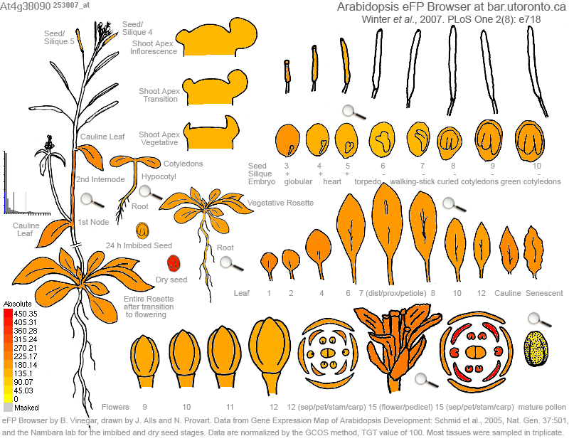
<figcaption>
<strong>Figure 5:</strong> Developmental Map from
Arabidopsis eFP Browser.
</figcaption>
</figure>

When investigating abiotic stressors via eFP, expression slightly
decreased in response to sustained exposure to cold temperatures.
Expression increased in response to osmotic stress, high salinity,
drought, genotoxins (bleomycins and mitomycin), oxidative stress (methyl
viologen), wounding, hypoxia, and elevated temperatures (38 ºC).
Expression levels were not significantly impacted by any of the biotic
stressors that were investigated, including *Pseudomonas syringae*,
*Phtophthora infestans*, and *Hyaloperonospora arabidopsidis*.
Expression levels were not affected by exposure to gibberellic acid
inhibitors, auxin inhibitors, brassinosteroid inhibitors, or ethylene
inhibitors.

To gain further insights into the biological processes that At4g38090
was involved in, it was prescient to investigate co-expressed genes
(i.e. “guilt by association”). BAR’s Expression Angler (EA) webapp was
used to identify the Top 50 co-expressed genes (**Table 1**) based on
the ‘Developmental Map’ view22. This view was chosen because
it emphasizes the two tissues with the highest expression levels visible
using eFP: dry seeds and mature flowers. The second highest r-value came
from AT4g14710 (r-value: 0.763). Investigating this gene using SUBA5
revealed MS-validated cytosolic localization, as opposed to the
mitochondrial localization observed with At4g3809012,23. When
the EA view was switched from ‘Developmental Map’ to ‘Guard and
Mesophyll Cells’ (which also showed high expression levels), AT4g14710
persisted as the top co-expressed gene (r-value: 0.763).

<figure>
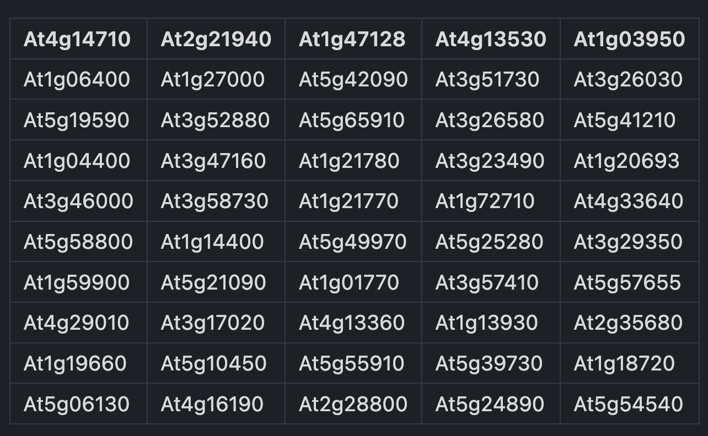
<figcaption>
<strong>Table 1:</strong> Top 50 co-expressed genes from
Expression Angler (EA).
</figcaption>
</figure>

Next, the ATTED-II database (version 11.1) was accessed to further
investigate co-expression patterns24. Using the ‘*condition*’
setting, the Top 300 co-expressed genes from the ‘*ath-m.4.tis*’ column
were collected. The resulting list was compared with the Top 50
co-expressed genes from EA, and the 7 genes that appeared in both lists
(**Table 2**) were recorded. These genes encode for propionyl-CoA
carboxylase (At1g01770), pyruvate dehydrogenase complex E1 alpha subunit
(AT1g59900), cyanase (At3g23490), TPR-like superfamily protein
(At3g26580), dnaJ-like chaperone protein (At5g06130), a quinone
reductase (At5g58800), and an uncharacterized protein
(At5g54540)2. With the exception of At5g58800 and At1g01770,
these all appear to be strongly expressed in dry seeds according to the
eFP Browser20. Additionally, aside from At5g06130 and
At5g58800, all of these genes are strongly expressed within guard cells.

<figure>
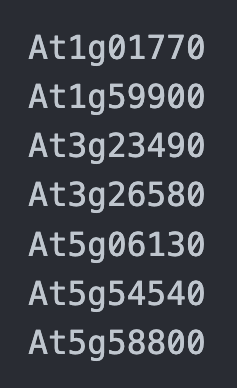
<figcaption>
<strong>Table 2:</strong> The 7 overlapping co-expressed
genes between EA and ATTED-II.
</figcaption>
</figure>

Cistome and MEME Suite were used to identify motifs among the EA list
and among the 7 genes in common between EA and ATTED-II22,25.
For Cistome (**Figure 6**) using the crossover list, the highest score
came from PRECONSCRHSP70A, which has been identified as a plastid
response elements' (PRE) in HSP70A promoters isolated from
*Chlamydomonas*26–28. It is thought to play a role in HSP70A
induction from light and Mg-protoporphyrin IX. The second-highest score
came from SURECOREATSULTR11, which forms the core of a sulfur-responsive
element (SURE) from an *Arabidopsis* high-affinity sulfate transporter
gene called SULTR1. GAGACA represents the auxin response factor (ARF)
binding sequence, which this motif forms part of. The only motif that
was missing from this list but present in the EA Top 50 list was
GTGANTG10. This GTGA motif was found in tobacco (*N. tabacum*) late
pollen gene g10 promoter and is homologous with pectate lyase. It is
also possibly a homologue of lat56, a gene from tomato29.
When an Analysis of Motif Enrichment (AME) search was run on the MEME
Suite webapp, 3XHMGBOX1 was identified as the only significant
motif25. Not much has been elucidated about this motif, aside
from the fact it is a high mobility group (HMG) box motif and is
associated with a domain of unknown function (DUF)30,31.

<figure>
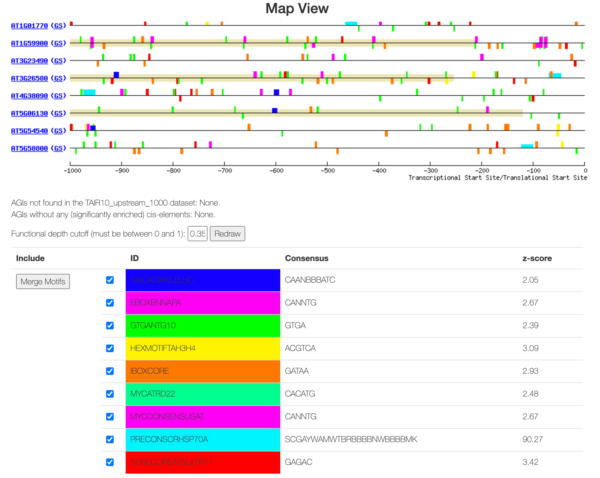
<figcaption>
<strong>Figure 6:</strong> Cistome results for EA +
ATTED-II crossover list.
</figcaption>
</figure>

Next, tools including Aranet, PLAZA, and g:Profiler were used to explore
Gene Ontology terms5,32,33. PLAZA suggested 2 biological
processes (“regulation of translational initiation” and “ribosome”) and
1 cellular component (“cytoplasm”). These all make sense given that this
gene encodes for a ribosomal protein. Meanwhile, g:Profiler highlighted
2 cellular component GO terms: “cytosol” and “microbody”. Using Aranet’s
“option 2” search template, it was possible to explore GO terms for the
neighbors of At4g3809032. The Top 5 GO terms that were
associated with neighbors were flavonoid biosynthetic process
(TT6/FLS1), mitochondrial DNA replication (PollA/PollB), plastid DNA
replication (PollA/PollB), response to zinc ion (PBA1), and regulation
of plant-type hypersensitive response (PBA1). The presence of
mitochondrial DNA replication among these neighbors offers additional
validation of the mitochondrial localization that was previously
suggested by SUBA5. There was, however, no overlap between these
“neighbors” and the lists that were previously derived from EA and
ATTED-II.

To further assist with the functional classification of At4g38090, the
AgriGO toolkit was used to identify enriched GO terms34. When
the Top 50 genes from Expression Angler were used as a query for
biological processes, the top two terms in the resulting map were
‘Oxidation Reduction’ and ‘Cellular Catabolic Process’. When cellular
components were explored (**Figure 7**), the top 2 categories were
‘cell’ and ‘organelle’. These eventually led to more specific terms
including ‘cytoplasm’, ‘intracellular membrane-bounded organelle’, and
‘nucleus’.

<figure>
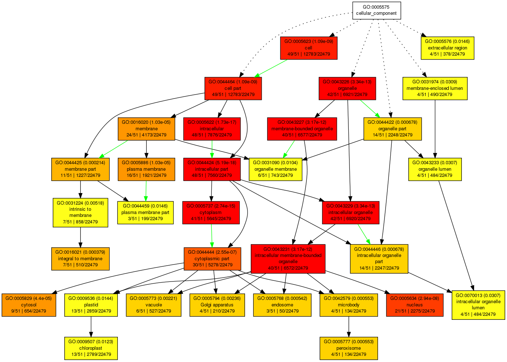
<figcaption>
<strong>Figure 7:</strong> A map of ‘Cellular Components’
GO terms, as generated by AgriGO.
</figcaption>
</figure>

The Arabidopsis Interaction Viewer (ver. 2.0) was used to begin
exploring protein-protein interactions (PPIs)35. The
resulting map (**Figure 8**) revealed a total of 5 PPIs involving
At4g38090, divided into 3 different subcellular localizations. Two
cytosolic proteins, MAP2A (methionine aminopeptidase 2A) and ETO2 (ACC
synthase 5), are involved in protein degradation and hormone metabolism,
respectively. The protein product of the gene At1g63280 is a serine
protease inhibitor involved in protein degradation within the
extracellular matrix. There were 2 additional proteins that were
co-localized in plastids alongside At4g38090. SVR3 is a member of the
Elongation Factor family, performing roles in protein synthesis and
elongation. Finally, At4g31210 encodes for a DNA Topoisomerase (type
IA), which is involved in DNA synthesis and chromatin architecture.

<figure>
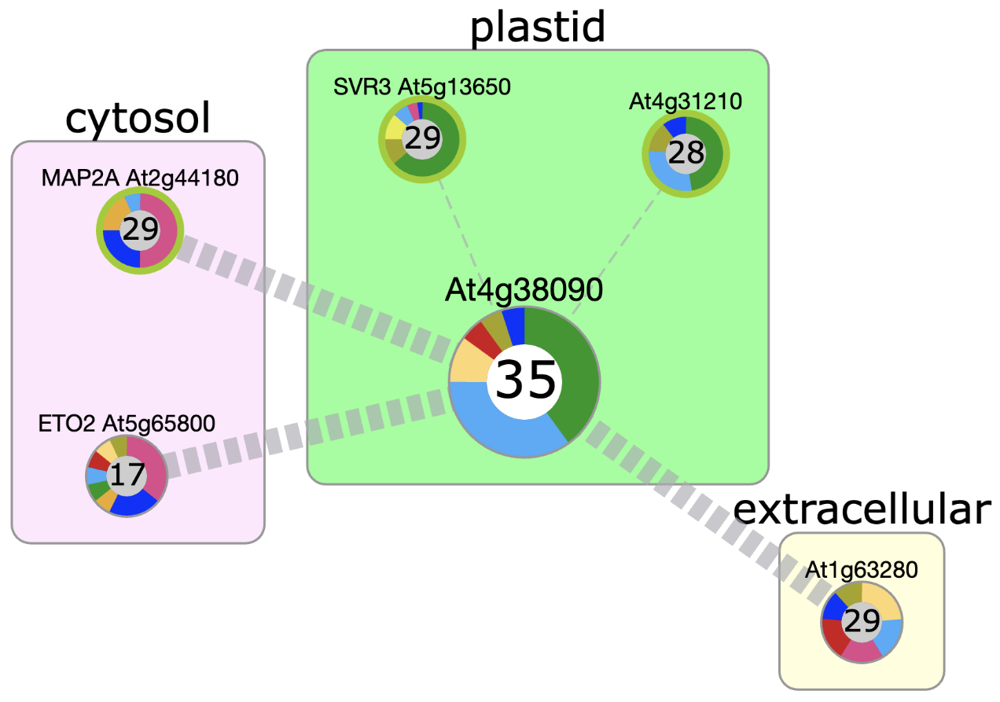
<figcaption>
<strong>Figure 8:</strong> PPIs from Arabidopsis
Interaction Viewer 2.0.
</figcaption>
</figure>

Next, the GeneMANIA prediction server was consulted to continue
exploring PPIs36. When the same 5 genes identified by the
Arabidopsis Interaction Viewer (alongside At4g38090) were used as the
query, the resulting network graph (**Figure 9**) revealed many observed
and predicted interactions between these genes and 20 others. The Top 5
genes in the network included EOL1, EOL2, ETO1, MAP1A, and AT1g64020 (an
unnamed serine protease inhibitor). The most prevalent biological
processes among the proteins in this network concern the synthesis and
metabolism of ethylene and other olefinic hydrocarbons. The next-most
prevalent processes were carbon-sulfur lyase activity and other forms of
amine metabolism. Subsequently, the 7 genes in common between Expression
Angler and ATTED-II were used as a query. The results confirmed that all
of these genes were co-expressed, although no other types of
interactions or processes were observed or predicted. Although it would
help to further explore these PPIs, the Virtual Plant database is
offline and TF2Network does not return any results using any of these
genes37,38.

<figure>
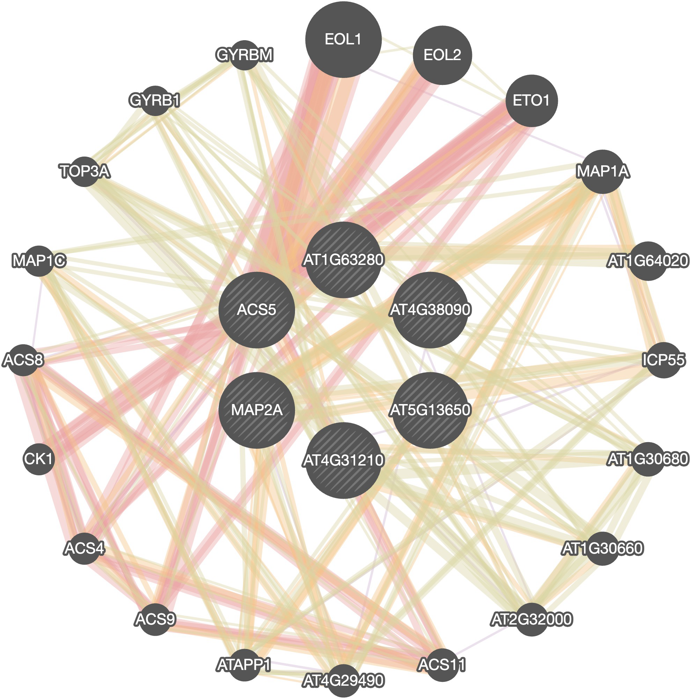
<figcaption>
<strong>Figure 9:</strong> GeneMANIA PPI
network.
</figcaption>
</figure>

### Summary

The ribosomal protein At4g38090 did not arise from a duplication event,
and its closest relative can be found in grapes. Its protein product
contains a YigZ-like domain similar to one originally isolated from an
*E. coli* specimen10. While there is evidence for
localization inside several membrane-bounded organelles, expression was
directly observed in mitochondria using tandem mass
spectrometry14. Expression levels were highest in dry seeds,
guard cells, and mature flowers, suggesting it may play a role in the
reproductive cycle. Cis-element analysis by Cistome identified
PRECONSCRHSP70A (involved in HSP70A induction from light and
Mg-protoporphyrin IX, SURECOREATSULTR11 (part of a sulfate transporter
gene called SULTR1), and GAGACA (part of an auxin response factor (ARF)
binding sequence). When the MEME Suite was used to perform an AME,
3XHMGBOX1 was the only result25. According to Aranet, GO
terms for this gene’s neighbors included flavonoid biosynthetic process
(TT6/FLS1), mitochondrial DNA replication (PollA/PollB), plastid DNA
replication (PollA/PollB), response to zinc ion (PBA1), and regulation
of plant-type hypersensitive response (PBA1). AgriGO associated this
gene with ‘Oxidation Reduction’ and ‘Cellular Catabolic Process’. The
Arabidopsis Interaction Viewer identified PPIs among 5 genes localized
in plastids, cytosol, and the extracellular space. Further investigation
of this network using GeneMANIA suggested roles in processes including
the synthesis and metabolism of olefinic hydrocarbons and carbon-sulfur
lyase activity for amine metabolism.

## Methodology

### *Initial impressions*

For the first step of completing these annotations, structural genomic
details were acquired from Ensembl Plants (https://plants.ensembl.org/),
National Center for Biotechnology Information
(https://www.ncbi.nlm.nih.gov/), and Araport
(https://www.araport.org/)1,39,40. Phylogenic relationships,
orthologues, paralogues, and homologues were explored using tools on
Ensembl Plants, PLAZA (https://bioinformatics.psb.ugent.be/plaza.dev/),
and Gramene (https://www.gramene.org)5,41. SUBA5 and the Cell
eFP Browser were the primary resources used for determining subcellular
localization, according to prediction algorithms and observations in the
literature12,16. The databases and other resources in this
section were utilized on November 25th, 2024.

### *Expression analysis*

The BAR Arabidopsis eFP Browser
(http://bar.utoronto.ca/efp/cgi-bin/efpWeb.cgi) and TraVA
(http://travadb.org/) were extensively used to identify expression
patterns within different tissues under varying
stressors18,20. Araport’s JBrowse tool was accessed to verify
these observations by using the published read alignment
data21. The protein product was annotated using the UniProt
and InterPro databases, while AlphaFold2 was used to model the mature
protein’s structure6,8,11. These tools were used on November
26th, 2024.

### Co-expression analysis

Expression Angler (https://bar.utoronto.ca/ExpressionAngler/) was used
to locate the Top 50 genes that are co-expressed alongside
At4g3809042. The ‘*Developmental Map’* was the most useful
view for this particular selection of genes. Next, the ATTED-II webapp
was used to identify the Top 300 co-expressed genes using the
*‘ath-m.4.tis’* column with the *‘conditions’* box checked. Both sets of
genes (EA and ATTED-II) were compared to find common elements, and it
was determined that 7 genes appeared in both sets. The Aranet tool was
used with *‘Option 2’* selected to determine GO terms of neighbors
amongst the previously collected sets of co-expressed genes. These tools
were used on December 1st, 2024.

### Promoter analysis

BAR’s Cistome toolkit
(https://www.bar.utoronto.ca/cistome/cgi-bin/BAR_Cistome.cgi) and the
MEME Suite’s AME algorithm (https://meme-suite.org/meme/tools/ame) were
used to identify motifs among the co-expressed genes22,25. On
Cistome, the PLACE database was queried using the *‘TAIR Upstream
(TSS/TrSS) 1000 bp promoter’* set. The *‘All PLACE elements’* option was
selected, with only significant motifs displayed. For AME, all default
settings were used during the search. These tools were used on December
1st, 2024.

### Functional classification & pathway visualization

The AgriGO database (http://systemsbiology.cau.edu.cn/agriGOv2/) was
used to identify GO terms associated with the genes from
EA34. The full set of GO terms was used for the search, with
a cutoff of at least 3 terms. These results were corroborated by
g:Profiler (https://biit.cs.ut.ee/gprofiler/) using the following
parameters: background ➜ ‘*AFFY_ATH1_121501’*; Significance threshold ➜
*‘Benjamini-Hochberg FDR’*; statistical domain ➜ *‘Custom over all known
genes’*. These tools were used on December 1st, 2024.

### Network tools

Protein-protein interactions were explored using GeneMANIA
(https://genemania.org/), Arabidopsis Interaction Viewer (ver. 2.0;
https://bar.utoronto.ca/interactions2/), ePlant
(https://bar.utoronto.ca/eplant/), and STRING
(https://string-db.org/). TF2Network
(http://bioinformatics.psb.ugent.be/webtools/TF2Network/) was also used,
but no enriched transcription factors were found using the set of 50
co-expressed genes from EA37.

## References

\(1\) Yates, A. D.; Allen, J.; Amode, R. M.; Azov, A. G.; Barba, M.;
Becerra, A.; Bhai, J.; Campbell, L. I.; Carbajo Martinez, M.;
Chakiachvili, M.; Chougule, K.; Christensen, M.; Contreras-Moreira, B.;
Cuzick, A.; Da Rin Fioretto, L.; Davis, P.; De Silva, N. H.;
Diamantakis, S.; Dyer, S.; Elser, J.; Filippi, C. V.; Gall, A.;
Grigoriadis, D.; Guijarro-Clarke, C.; Gupta, P.; Hammond-Kosack, K. E.;
Howe, K. L.; Jaiswal, P.; Kaikala, V.; Kumar, V.; Kumari, S.; Langridge,
N.; Le, T.; Luypaert, M.; Maslen, G. L.; Maurel, T.; Moore, B.; Muffato,
M.; Mushtaq, A.; Naamati, G.; Naithani, S.; Olson, A.; Parker, A.;
Paulini, M.; Pedro, H.; Perry, E.; Preece, J.; Quinton-Tulloch, M.;
Rodgers, F.; Rosello, M.; Ruffier, M.; Seager, J.; Sitnik, V.; Szpak,
M.; Tate, J.; Tello-Ruiz, M. K.; Trevanion, S. J.; Urban, M.; Ware, D.;
Wei, S.; Williams, G.; Winterbottom, A.; Zarowiecki, M.; Finn, R. D.;
Flicek, P. Ensembl Genomes 2022: An Expanding Genome Resource for
Non-Vertebrates. *Nucleic Acids Res.* **2022**, *50* (D1), D996–D1003.
https://doi.org/10.1093/nar/gkab1007.

\(2\) The International Arabidopsis Informatics Consortium. Taking the
Next Step: Building an Arabidopsis Information Portal. *Plant Cell*
**2012**, *24* (6), 2248–2256. https://doi.org/10.1105/tpc.112.100669.

\(3\) International Arabidopsis Informatics Consortium. An International
Bioinformatics Infrastructure to Underpin the Arabidopsis Community.
*Plant Cell* **2010**, *22* (8), 2530–2536.
https://doi.org/10.1105/tpc.110.078519.

\(4\) Berardini, T. Z.; Reiser, L.; Li, D.; Mezheritsky, Y.; Muller, R.;
Strait, E.; Huala, E. The Arabidopsis Information Resource: Making and
Mining the “Gold Standard” Annotated Reference Plant Genome. *Genes. N.
Y. N 2000* **2015**, *53* (8), 474–485.
https://doi.org/10.1002/dvg.22877.

\(5\) Van Bel, M.; Silvestri, F.; Weitz, E. M.; Kreft, L.; Botzki, A.;
Coppens, F.; Vandepoele, K. PLAZA 5.0: Extending the Scope and Power of
Comparative and Functional Genomics in Plants. *Nucleic Acids Res.*
**2022**, *50* (D1), D1468–D1474. https://doi.org/10.1093/nar/gkab1024.

\(6\) The UniProt Consortium. UniProt: The Universal Protein
Knowledgebase in 2025. *Nucleic Acids Res.* **2024**, gkae1010.
https://doi.org/10.1093/nar/gkae1010.

\(7\) Jones, P.; Binns, D.; Chang, H.-Y.; Fraser, M.; Li, W.; McAnulla,
C.; McWilliam, H.; Maslen, J.; Mitchell, A.; Nuka, G.; Pesseat, S.;
Quinn, A. F.; Sangrador-Vegas, A.; Scheremetjew, M.; Yong, S.-Y.; Lopez,
R.; Hunter, S. InterProScan 5: Genome-Scale Protein Function
Classification. *Bioinformatics* **2014**, *30* (9), 1236–1240.
https://doi.org/10.1093/bioinformatics/btu031.

\(8\) Paysan-Lafosse, T.; Blum, M.; Chuguransky, S.; Grego, T.; Pinto,
B. L.; Salazar, G. A.; Bileschi, M. L.; Bork, P.; Bridge, A.; Colwell,
L.; Gough, J.; Haft, D. H.; Letunić, I.; Marchler-Bauer, A.; Mi, H.;
Natale, D. A.; Orengo, C. A.; Pandurangan, A. P.; Rivoire, C.; Sigrist,
C. J. A.; Sillitoe, I.; Thanki, N.; Thomas, P. D.; Tosatto, S. C. E.;
Wu, C. H.; Bateman, A. InterPro in 2022. *Nucleic Acids Res.* **2023**,
*51* (D1), D418–D427. https://doi.org/10.1093/nar/gkac993.

\(9\) Thomas, P. D.; Ebert, D.; Muruganujan, A.; Mushayahama, T.; Albou,
L.-P.; Mi, H. PANTHER: Making Genome-Scale Phylogenetics Accessible to
All. *Protein Sci. Publ. Protein Soc.* **2022**, *31* (1), 8–22.
https://doi.org/10.1002/pro.4218.

\(10\) Park, F.; Gajiwala, K.; Eroshkina, G.; Furlong, E.; He, D.;
Batiyenko, Y.; Romero, R.; Christopher, J.; Badger, J.; Hendle, J.; Lin,
J.; Peat, T.; Buchanan, S. Crystal Structure of YIGZ, a Conserved
Hypothetical Protein from Escherichia Coli K12 with a Novel Fold.
*Proteins Struct. Funct. Bioinforma.* **2004**, *55* (3), 775–777.
https://doi.org/10.1002/prot.20087.

\(11\) Jumper, J.; Evans, R.; Pritzel, A.; Green, T.; Figurnov, M.;
Ronneberger, O.; Tunyasuvunakool, K.; Bates, R.; Žídek, A.; Potapenko,
A.; Bridgland, A.; Meyer, C.; Kohl, S. A. A.; Ballard, A. J.; Cowie, A.;
Romera-Paredes, B.; Nikolov, S.; Jain, R.; Adler, J.; Back, T.;
Petersen, S.; Reiman, D.; Clancy, E.; Zielinski, M.; Steinegger, M.;
Pacholska, M.; Berghammer, T.; Bodenstein, S.; Silver, D.; Vinyals, O.;
Senior, A. W.; Kavukcuoglu, K.; Kohli, P.; Hassabis, D. Highly Accurate
Protein Structure Prediction with AlphaFold. *Nature* **2021**, *596*
(7873), 583–589. https://doi.org/10.1038/s41586-021-03819-2.

\(12\) Hooper, C. M.; Castleden, I. R.; Tanz, S. K.; Aryamanesh, N.;
Millar, A. H. SUBA4: The Interactive Data Analysis Centre for
Arabidopsis Subcellular Protein Locations. *Nucleic Acids Res.*
**2017**, *45* (D1), D1064–D1074. https://doi.org/10.1093/nar/gkw1041.

\(13\) *Subcellular Localisation database for Arabidopsis proteins
version 5*. the UWA Profiles and Research Repository.
https://research-repository.uwa.edu.au/en/datasets/subcellular-localisation-database-for-arabidopsis-proteins-versio-3
(accessed 2024-12-02).

\(14\) Fuchs, P.; Rugen, N.; Carrie, C.; Elsässer, M.; Finkemeier, I.;
Giese, J.; Hildebrandt, T. M.; Kühn, K.; Maurino, V. G.; Ruberti, C.;
Schallenberg-Rüdinger, M.; Steinbeck, J.; Braun, H.-P.; Eubel, H.;
Meyer, E. H.; Müller-Schüssele, S. J.; Schwarzländer, M. Single
Organelle Function and Organization as Estimated from Arabidopsis
Mitochondrial Proteomics. *Plant J. Cell Mol. Biol.* **2020**, *101*
(2), 420–441. https://doi.org/10.1111/tpj.14534.

\(15\) Bannai, H.; Tamada, Y.; Maruyama, O.; Nakai, K.; Miyano, S.
Extensive Feature Detection of N-Terminal Protein Sorting Signals.
*Bioinformatics* **2002**, *18* (2), 298–305.
https://doi.org/10.1093/bioinformatics/18.2.298.

\(16\) *Cell eFP Browser*.
https://bar.utoronto.ca/cell_efp/cgi-bin/cell_efp.cgi (accessed
2024-12-02).

\(17\) Klepikova, A. V.; Logacheva, M. D.; Dmitriev, S. E.; Penin, A. A.
RNA-Seq Analysis of an Apical Meristem Time Series Reveals a Critical
Point in Arabidopsis Thaliana Flower Initiation. *BMC Genomics*
**2015**, *16* (1), 466. https://doi.org/10.1186/s12864-015-1688-9.

\(18\) Klepikova, A. V.; Kasianov, A. S.; Gerasimov, E. S.; Logacheva,
M. D.; Penin, A. A. A High-Resolution Map of the Arabidopsis Thaliana
Developmental Transcriptome Based on RNA-Seq Profiling. *Plant J.*
**2016**, *88* (6), 1058–1070. https://doi.org/10.1111/tpj.13312.

\(19\) *An “Electronic Fluorescent Pictograph” Browser for Exploring and
Analyzing Large-Scale Biological Data Sets \| PLOS ONE*.
https://journals.plos.org/plosone/article?id=10.1371/journal.pone.0000718
(accessed 2024-12-02).

\(20\) *Arabidopsis eFP Browser*.
https://bar.utoronto.ca/efp/cgi-bin/efpWeb.cgi (accessed 2024-12-02).

\(21\) Diesh, C.; Stevens, G. J.; Xie, P.; De Jesus Martinez, T.;
Hershberg, E. A.; Leung, A.; Guo, E.; Dider, S.; Zhang, J.; Bridge, C.;
Hogue, G.; Duncan, A.; Morgan, M.; Flores, T.; Bimber, B. N.; Haw, R.;
Cain, S.; Buels, R. M.; Stein, L. D.; Holmes, I. H. JBrowse 2: A Modular
Genome Browser with Views of Synteny and Structural Variation. *Genome
Biol.* **2023**, *24* (1), 74.
https://doi.org/10.1186/s13059-023-02914-z.

\(22\) Austin, R. S.; Hiu, S.; Waese, J.; Ierullo, M.; Pasha, A.; Wang,
T. T.; Fan, J.; Foong, C.; Breit, R.; Desveaux, D.; Moses, A.; Provart,
N. J. New BAR Tools for Mining Expression Data and Exploring
Cis-Elements in Arabidopsis Thaliana. *Plant J.* **2016**, *88* (3),
490–504. https://doi.org/10.1111/tpj.13261.

\(23\) McBride, Z.; Chen, D.; Lee, Y.; Aryal, U. K.; Xie, J.; Szymanski,
D. B. A Label-Free Mass Spectrometry Method to Predict Endogenous
Protein Complex Composition. *Mol. Cell. Proteomics MCP* **2019**, *18*
(8), 1588–1606. https://doi.org/10.1074/mcp.RA119.001400.

\(24\) Obayashi, T.; Hibara, H.; Kagaya, Y.; Aoki, Y.; Kinoshita, K.
ATTED-II V11: A Plant Gene Coexpression Database Using a Sample
Balancing Technique by Subagging of Principal Components. *Plant Cell
Physiol.* **2022**, *63* (6), 869–881.
https://doi.org/10.1093/pcp/pcac041.

\(25\) Bailey, T. L.; Boden, M.; Buske, F. A.; Frith, M.; Grant, C. E.;
Clementi, L.; Ren, J.; Li, W. W.; Noble, W. S. MEME Suite: Tools for
Motif Discovery and Searching. *Nucleic Acids Res.* **2009**, *37*
(suppl_2), W202–W208. https://doi.org/10.1093/nar/gkp335.

\(26\) von Gromoff, E. D.; Schroda, M.; Oster, U.; Beck, C. F.
Identification of a Plastid Response Element That Acts as an Enhancer
within the Chlamydomonas HSP70A Promoter. *Nucleic Acids Res.* **2006**,
*34* (17), 4767–4779. https://doi.org/10.1093/nar/gkl602.

\(27\) Higo, K.; Ugawa, Y.; Iwamoto, M.; Korenaga, T. Plant Cis-Acting
Regulatory DNA Elements (PLACE) Database: 1999. *Nucleic Acids Res.*
**1999**, *27* (1), 297–300. https://doi.org/10.1093/nar/27.1.297.

\(28\) Wang, Y.; Hou, J.; Liu, H.; Li, T.; Wang, K.; Hao, C.; Liu, H.;
Zhang, X. TaBT1, Affecting Starch Synthesis and Thousand Kernel Weight,
Underwent Strong Selection during Wheat Improvement. *J. Exp. Bot.*
**2019**, *70* (5), 1497–1511. https://doi.org/10.1093/jxb/erz032.

\(29\) Rogers, H. J.; Bate, N.; Combe, J.; Sullivan, J.; Sweetman, J.;
Swan, C.; Lonsdale, D. M.; Twell, D. Functional Analysis of
Cis-Regulatory Elements within the Promoter of the Tobacco Late Pollen
Gene G10. *Plant Mol. Biol.* **2001**, *45* (5), 577–585.
https://doi.org/10.1023/A:1010695226241.

\(30\) Sebastian, A.; Contreras-Moreira, B. footprintDB: A Database of
Transcription Factors with Annotated Cis Elements and Binding
Interfaces. *Bioinformatics* **2014**, *30* (2), 258–265.
https://doi.org/10.1093/bioinformatics/btt663.

\(31\) O’Malley, R. C.; Huang, S. C.; Song, L.; Lewsey, M. G.; Bartlett,
A.; Nery, J. R.; Galli, M.; Gallavotti, A.; Ecker, J. R. Cistrome and
Epicistrome Features Shape the Regulatory DNA Landscape. *Cell*
**2016**, *165* (5), 1280–1292.
https://doi.org/10.1016/j.cell.2016.04.038.

\(32\) Lee, T.; Yang, S.; Kim, E.; Ko, Y.; Hwang, S.; Shin, J.; Shim, J.
E.; Shim, H.; Kim, H.; Kim, C.; Lee, I. AraNet v2: An Improved Database
of Co-Functional Gene Networks for the Study of Arabidopsis Thaliana and
27 Other Nonmodel Plant Species. *Nucleic Acids Res.* **2015**, *43*
(D1), D996–D1002. https://doi.org/10.1093/nar/gku1053.

\(33\) Kolberg, L.; Raudvere, U.; Kuzmin, I.; Adler, P.; Vilo, J.;
Peterson, H. G:Profiler—Interoperable Web Service for Functional
Enrichment Analysis and Gene Identifier Mapping (2023 Update). *Nucleic
Acids Res.* **2023**, *51* (W1), W207–W212.
https://doi.org/10.1093/nar/gkad347.

\(34\) Du, Z.; Zhou, X.; Ling, Y.; Zhang, Z.; Su, Z. agriGO: A GO
Analysis Toolkit for the Agricultural Community. *Nucleic Acids Res.*
**2010**, *38* (suppl_2), W64–W70. https://doi.org/10.1093/nar/gkq310.

\(35\) *Arabidopsis Interactions Viewer (AIV) 2.0*.
https://bar.utoronto.ca/interactions2/ (accessed 2024-12-04).

\(36\) Warde-Farley, D.; Donaldson, S. L.; Comes, O.; Zuberi, K.;
Badrawi, R.; Chao, P.; Franz, M.; Grouios, C.; Kazi, F.; Lopes, C. T.;
Maitland, A.; Mostafavi, S.; Montojo, J.; Shao, Q.; Wright, G.; Bader,
G. D.; Morris, Q. The GeneMANIA Prediction Server: Biological Network
Integration for Gene Prioritization and Predicting Gene Function.
*Nucleic Acids Res.* **2010**, *38* (suppl_2), W214–W220.
https://doi.org/10.1093/nar/gkq537.

\(37\) Kulkarni, S. R.; Vaneechoutte, D.; Van de Velde, J.; Vandepoele,
K. TF2Network: Predicting Transcription Factor Regulators and Gene
Regulatory Networks in Arabidopsis Using Publicly Available Binding Site
Information. *Nucleic Acids Res.* **2018**, *46* (6), e31.
https://doi.org/10.1093/nar/gkx1279.

\(38\) Katari, M. S.; Nowicki, S. D.; Aceituno, F. F.; Nero, D.; Kelfer,
J.; Thompson, L. P.; Cabello, J. M.; Davidson, R. S.; Goldberg, A. P.;
Shasha, D. E.; Coruzzi, G. M.; Gutiérrez, R. A. VirtualPlant: A Software
Platform to Support Systems Biology Research. *Plant Physiol.* **2010**,
*152* (2), 500–515. https://doi.org/10.1104/pp.109.147025.

\(39\) Krishnakumar, V.; Hanlon, M. R.; Contrino, S.; Ferlanti, E. S.;
Karamycheva, S.; Kim, M.; Rosen, B. D.; Cheng, C.-Y.; Moreira, W.; Mock,
S. A.; Stubbs, J.; Sullivan, J. M.; Krampis, K.; Miller, J. R.; Micklem,
G.; Vaughn, M.; Town, C. D. Araport: The Arabidopsis Information Portal.
*Nucleic Acids Res.* **2015**, *43* (D1), D1003–D1009.
https://doi.org/10.1093/nar/gku1200.

\(40\) Sayers, E. W.; Bolton, E. E.; Brister, J. R.; Canese, K.; Chan,
J.; Comeau, D. C.; Connor, R.; Funk, K.; Kelly, C.; Kim, S.; Madej, T.;
Marchler-Bauer, A.; Lanczycki, C.; Lathrop, S.; Lu, Z.; Thibaud-Nissen,
F.; Murphy, T.; Phan, L.; Skripchenko, Y.; Tse, T.; Wang, J.; Williams,
R.; Trawick, B. W.; Pruitt, K. D.; Sherry, S. T. Database Resources of
the National Center for Biotechnology Information. *Nucleic Acids Res.*
**2022**, *50* (D1), D20–D26. https://doi.org/10.1093/nar/gkab1112.

\(41\) Tello-Ruiz, M. K.; Jaiswal, P.; Ware, D. Gramene: A Resource for
Comparative Analysis of Plants Genomes and Pathways. In *Plant
Bioinformatics: Methods and Protocols*; Edwards, D., Ed.; Springer US:
New York, NY, 2022; pp 101–131.
https://doi.org/10.1007/978-1-0716-2067-0_5.

\(42\) *Expression Angler*. https://bar.utoronto.ca/ExpressionAngler/
(accessed 2024-12-05).

\(43\) *ePlant*. https://bar.utoronto.ca/eplant/ (accessed 2024-12-06).

\(44\) Szklarczyk, D.; Kirsch, R.; Koutrouli, M.; Nastou, K.; Mehryary,
F.; Hachilif, R.; Gable, A. L.; Fang, T.; Doncheva, N. T.; Pyysalo, S.;
Bork, P.; Jensen, L. J.; von Mering, C. The STRING Database in 2023:
Protein–Protein Association Networks and Functional Enrichment Analyses
for Any Sequenced Genome of Interest. *Nucleic Acids Res.* **2023**,
*51* (D1), D638–D646. https://doi.org/10.1093/nar/gkac1000.
